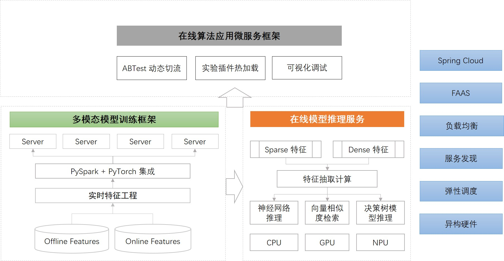

# MetaSpore 一站式机器学习开发平台

MetaSpore 是一个一站式端到端的机器学习开发平台，提供从数据预处理、模型训练、离线实验、在线预测到在线实验分桶 ABTest 的全流程框架和开发接口。



MetaSpore 由[元灵数智](https://www.dmetasoul.com/)团队开发，欢迎关注我们的[公众号和微信交流群](#微信公众号)。

## 新闻链接：
* 2022-06-10：[基于MetaSpore on AlphaIDE快速落地风控算法](https://mp.weixin.qq.com/s/htBFRBYke2m9inrtXF5T-Q)
* 2022-05-18：[AlphaIDE - 新一代AI开发生产平台开放内测](https://mp.weixin.qq.com/s/W54VLwu6tycPa-45gOvBzg)
* 2022-05-07：[多模态语义检索 | 基于 MetaSpore 快速部署 HuggingFace 预训练模型](https://mp.weixin.qq.com/s/hZ-z_iFHXvWiFHVBFYB8Gg)
* 2022-04-12：[重磅！开源湖仓平台 LakeSoul 设计理念详解](https://mp.weixin.qq.com/s/X12CiDgL5kRE4uBPOu15aw)
* 2022-04-02：[揭秘！新一代一站式机器学习平台MetaSpore的设计理念](https://mp.weixin.qq.com/s/uiqvpQ4VHAlL6V3dgzDwig)
* 2022-03-31：[重磅！基于新一代MetaSpore平台快速搭建工业级推荐系统](https://mp.weixin.qq.com/s/vy6aCSGrVNepD9uQZOy9Lg)

## 核心功能
MetaSpore 具有如下几个特点：

1. 一站式端到端开发，从离线模型训练到在线预测和分桶实验，全链路统一的开发体验；
2. 深度学习训练框架，兼容 PyTorch 生态，支持分布式大规模稀疏特征学习
2. 训练框架与 PySpark 打通，无缝读取数据湖和数仓上的训练数据；
3. 高性能在线预测服务，支持神经网络、决策树、Spark ML、SKLearn 等多种模型；支持异构计算推理加速；
4. 在离线统一特征抽取框架，自动生成线上特征读取逻辑，统一特征抽取逻辑；
5. 在线算法应用框架，提供模型预测、实验分桶切流、参数动态热加载和丰富的 Debug 功能；
6. 丰富的行业算法示例和端到端完整链路解决方案。

## 文档和示例

* [离线训练入门教程](tutorials/metaspore-getting-started.ipynb)

* [在线算法应用框架 (Java 版)](java/online-serving/README-CN.md)

    * [在线模型预测](java/online-serving/serving/README-CN.md)
    * [在线特征抽取](java/online-serving/feature-extract/README-CN.md)
    * [在线实验切流和 ABTest](java/online-serving/experiment-pipeline/README-CN.md)

* [一个 MovieLens 端到端推荐系统](demo/movielens)
    * [离线模型](demo/movielens/offline/README-CN.md)
    * [在线算法推荐系统（Java 实现）](demo/movielens/online/README-CN.md)

## 安装包下载
我们提供了一个预编译的离线训练安装包：[下载链接](https://ks3-cn-beijing.ksyuncs.com/dmetasoul-bucket/releases/metaspore/metaspore-1.0.0%2B48beee4-cp38-cp38-linux_x86_64.whl)。 该安装包依赖 Python 3.8.

运行 MetaSpore 离线训练，还需要 PySpark 和 PyTorch。可以通过 `pip` 命令进行安装：
```bash
pip install pyspark
pip install torch==1.11.0+cpu -f https://download.pytorch.org/whl/cpu/torch_stable.html
pip install metaspore-1.0.0+48beee4-cp38-cp38-linux_x86_64.whl
```

Spark 官方打包的 PySpark，没有包含 hadoop-cloud 的 jar 包，无法访问 S3 等云存储。我们提供了一个打包好 S3 客户端的 [PySpark 安装包](https://ks3-cn-beijing.ksyuncs.com/dmetasoul-bucket/releases/spark/pyspark-3.1.2.f8301b97d4-py2.py3-none-any.whl)，可以从这里下载后安装：
```bash
pip install pyspark-3.1.2.f8301b97d4-py2.py3-none-any.whl
```

关于如何设置 S3 等云存储的访问，请参考 [配置 MetaSpore 离线训练 S3 访问权限](docs/s3-access-cn.md)

## 编译代码

* [离线训练框架编译](docs/build-offline.md)

## 社区准则
[社区准则](community-guideline-cn.md)

## 问题反馈

关于使用上的问题，可以在 [GitHub Discussion](https://github.com/meta-soul/MetaSpore/discussions) 中发帖提问，也可以通过 [GitHub Issue](https://github.com/meta-soul/MetaSpore/issues) 反馈。

### 邮箱
可以通过 [opensource@dmetasoul.com](mailto:opensource@dmetasoul.com) 给我们发送邮件。

### 微信公众号
欢迎关注 <u>**元灵数智**</u> 公众号，我们会定期推送关于 MetaSpore 的架构代码解读、端到端算法业务落地案例分享等干货文章：


### MetaSpore 开发者社区微信群
欢迎扫码加入 MetaSpore 开发者社区微信群，随时交流 MetaSpore 开发相关的各类问题：


如果群二维码失效，请关注公众号后点击下方 "了解我们-用户交流" 获取最新微信群二维码。

## 开源项目
MetaSpore 是一个完全开源的项目，以 Apache License 2.0 协议发布。欢迎参与使用、反馈和贡献代码。
