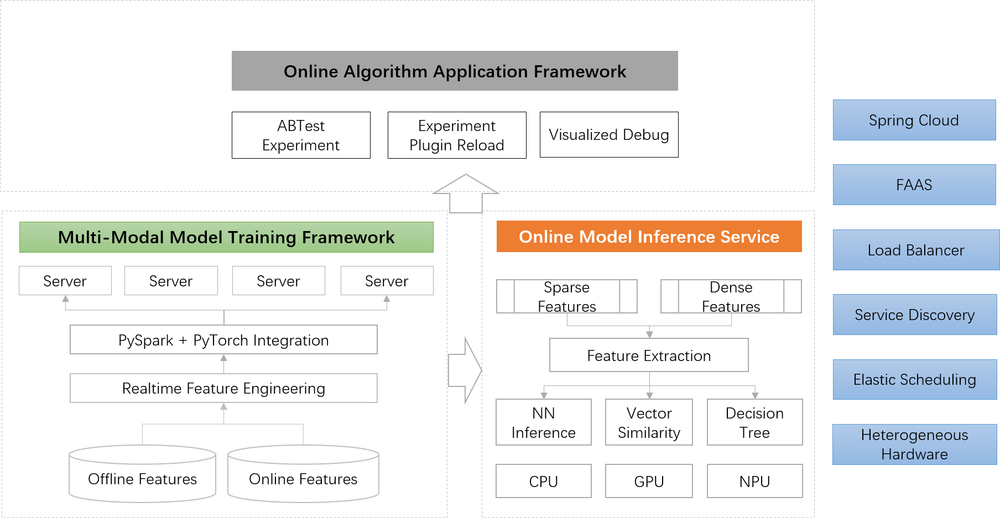

## [中文介绍](README-CN.md)

# MetaSpore: One-stop machine learning development platform

MetaSpore is a one-stop end-to-end machine learning development platform that provides a full-cycle framework and development interface for from data preprocessing, model training, offline experiments, online predictions to online experiment bucketization and ab-testing.



MetaSpore is developed and opensourced by [DMetaSoul](https://github.com/meta-soul?type=source) team. You could also join our [slack user discussion space](https://join.slack.com/t/dmetasoul-user/shared_invite/zt-1681xagg3-4YouyW0Y4wfhPnvji~OwFg).


## Core Features
MetaSpore has the following features:

1. One-stop end-to-end development, from offline model training to online prediction and bucketing experiments, with a unified development experience across the entire process;
2. Deep learning training framework, compatible with PyTorch ecology, supports distributed large-scale sparse feature learning;
2. The training framework is connected with PySpark to seamlessly read the training data from the data lake and data warehouse;
3. High-performance online prediction service, supports fast inference for neural network, decision tree, Spark ML, SKLearn and other models; supports heterogeneous computing inference acceleration;
4. In the offline unified feature extraction framework, the online feature reading logic is automatically generated, and the feature extraction logic is unified cross offline and online;
5. Online algorithm application framework, providing model prediction, experiment bucketing and traffic splitting, dynamic hot loading of parameters and rich debug functions;
6. Rich industry algorithm examples and end-to-end solutions.

## Documentation and examples

* [Offline Training Getting Started Tutorial](tutorials/metaspore-getting-started.ipynb)

* [Online Algorithm Application (Java implementation)](java/online-serving/README.md)

    * [Online Model Serving](java/online-serving/serving/README.md)
    * [Online Feature Extraction](java/online-serving/feature-extract/README.md)
    * [Online Experiment Pipeline](java/online-serving/experiment-pipeline/README.md)

* [A MovieLens end-to-end recommender system demo](demo/movielens), including
    * [Offline models](demo/movielens/offline)
    * [Online algorithm application (Java implementation)](demo/movielens/online)

## Installation package download
We provide a precompiled offline training installation package: [download link](https://ks3-sgp.ksyuncs.com/dmetasoul-release-sg/releases/metaspore/metaspore-1.0.0%2B9591a50-cp38-cp38-linux_x86_64.whl). This package requires Python 3.8.

After downloading, in the Python 3.8 environment, execute the installation through the command line:
```bash
pip install pyspark
pip install torch==1.11.0+cpu -f https://download.pytorch.org/whl/cpu/torch_stable.html
pip install metaspore-1.0.0+9591a50-cp38-cp38-linux_x86_64.whl
```

## Compile the code

* [Offline training framework compilation](docs/build-offline.md)

## Feedback

For questions about usage, you can post questions in [GitHub Discussion](https://github.com/meta-soul/MetaSpore/discussions), or through [GitHub Issue](https://github.com/meta-soul/MetaSpore/issues).

### Mail
Email us at [opensource@dmetasoul.com](mailto:opensource@dmetasoul.com).

### Slack
Join our user discussion slack channel: [MetaSpore User Discussion](https://join.slack.com/t/dmetasoul-user/shared_invite/zt-1681xagg3-4YouyW0Y4wfhPnvji~OwFg)

## Open source projects
MetaSpore is a completely open source project released under the Apache License 2.0. Participation, feedback, and code contributions are welcome.