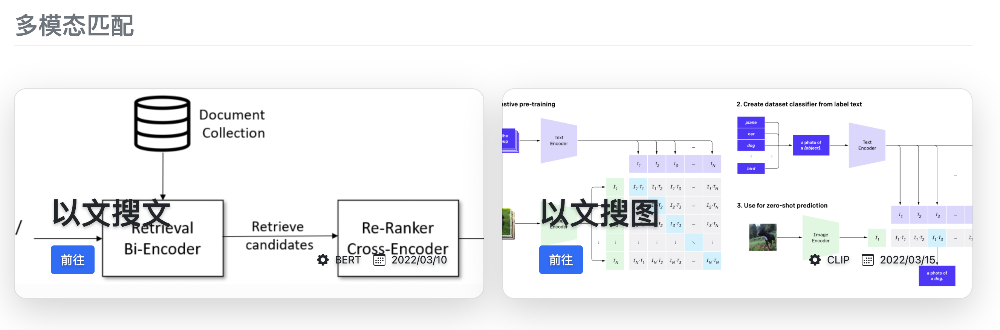
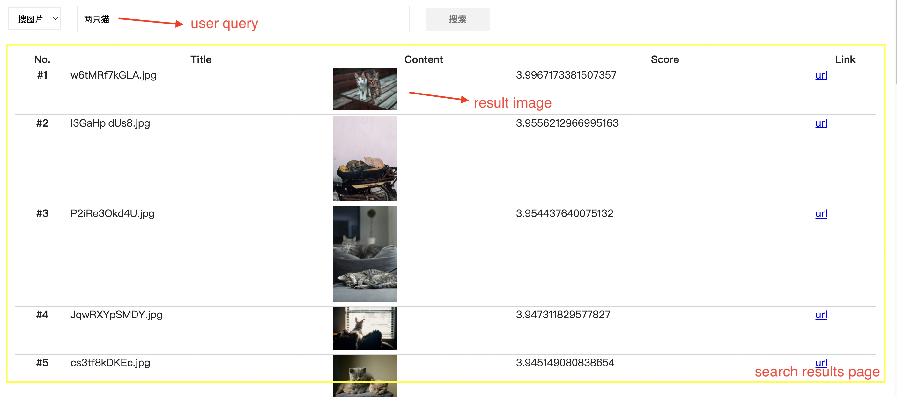

# 多模态检索 Demo

深度学习在计算机视觉、自然语言处理等领域不断取得创新性突破，不同模态数据之间联合建模的多模态理解技术也越发成熟。前沿技术进展使得*打通多模态数据之间的语义鸿沟*成为可能，但繁复的离线模型优化、数据处理、高昂的线上推理和实验成本等因素，阻碍了多模态技术的落地和普惠。

本项目将围绕**以文搜文**、**以文搜图**等多模态检索场景，来向大家演示，如何基于 [**MetaSpore**](https://github.com/meta-soul/MetaSpore) 技术体系低成本接入 [HuggingFace](https://huggingface.co/) 社区多模态预训练模型。

   

本项目 Demo 将提供从*离线数据处理到在线检索服务*一整套解决方案

- **在线服务**，一整套多模态检索线上体系，支撑以文搜文、以文搜图等多场景语义检索，涵盖前端检索 UI、数据预处理、检索召回/排序算法等服务
- **离线处理**，涵盖 demo 各个语义检索场景的离线部分，主要有离线模型训练和导出、检索数据建库以及推送线上服务组件等

## 1. 在线服务

多模态 Demo 线上服务部分由以下几部分构成：

1. [multimodal_web](online/multimodal_web)，多模态示例的前端服务，提供 web UI 界面供用户体验多模态检索能力
2. [multimodal_serving](online/multimodal_serving)，多模态示例的检索算法服务，含有实验配置、预处理、召回、排序等整个算法处理链路
3. [multimodal_preprocess](online/multimodal_preprocess)，对多模态大模型预处理逻辑（含文本/图像等）的封装，以 gRPC 接口提供服务

线上服务搭建的具体步骤，参考[操作指南](online/README-CN.md)。

## 2. 离线处理

离线处理部分，主要包含了各个应用场景 demo 的离线模型导出、数据建库推送等内容：

1. **数据**建库索引以及推送到线上服务组件，如 `Milvus`, `MongoDB`
2. **模型**导出以及推送线上服务组件，如 `MetaSpore Serving`

由于以文搜文和以文搜图场景离线部分较为类似，具体离线操作流程可以重点参考**百科问答**数据的[以文搜文离线部分](offline/QA/README-CN.md)。

## 3. Demo 演示

当按照上述文档指引把离线和在线工作准备就绪后，就可以打开 [multimodal_web](online/multimodal_web) 服务默认[地址](http://127.0.0.1:8090)来访问多模态检索服务啦！

**以文搜文**示例：

（1）**Query="如何补办身份证"**

  

（2）**Query="怎么买火车票"**

  

**以文搜图**示例：

（1）**Query="两只猫"**

  

（2）**Query="两只猫在草地"**

  

