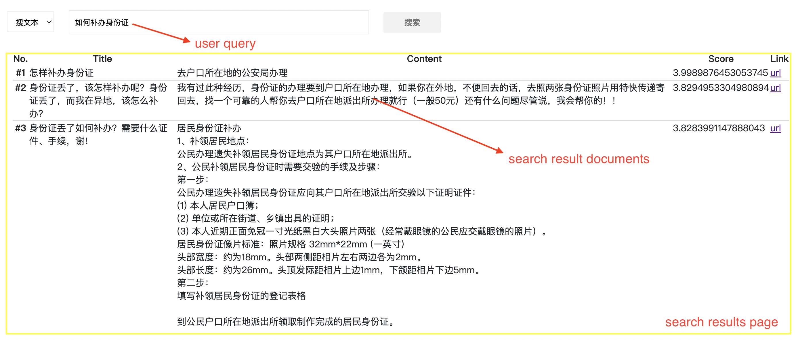
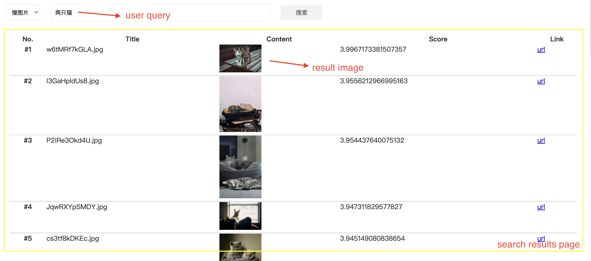
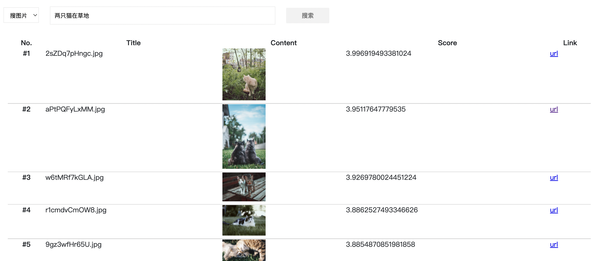

## [中文介绍](README-CN.md)

# Multimodal Retrieval Demo

Deep learning has made innovative breakthroughs in computer vision (CV), natural language processing (NLP) and other fields, and the multimodal understanding technology of joint modeling between different modal data has become more and more mature. The SOTA technologies have made it possible to bridge the semantic gap between multimodal data, but factors such as complicated offline model optimization, data processing, high online inference and experimental costs have hindered the landing and popularization of multimodal technology. 

This project will focus on *search text by text* (**T2T**), *search image by text* (**T2I**) and other multimodal retrieval scenarios, to demonstrate to you how to easily access [HuggingFace](https://huggingface.co/) multimodal pretrained models with our [**MetaSpore**](https://github.com/meta-soul/MetaSpore) technology ecology.

The demo will provide a whole of solution from offline data processing to online retrieval services:

- **Online Service**, a multimodal retrieval online system, supporting multi-scenario semantic retrieval such as text search, image search, etc., covering retrieval web UI, query preprocessing, retrieval matching/ranking algorithm and other services.
- **Offline Processing**, covering the offline part of each semantic retrieval scenario of the demo, mainly including offline model training and export, retrieval database indexing and pushing.

## 1. Online Service

The Multimodal Demo online service consists of the following parts:

1. [multimodal_web](online/multimodal_web), a front-end service for multimodal demo, providing a web UI interface for users to experience multimodal retrieval service.
2. [multimodal_serving](online/multimodal_serving), retrieval online service for multimodal demo, including the entire algorithm pipeline such as a/b experimental configuration, query preprocessing, matching, ranking, summary, etc.
3. [multimodal_preprocess](online/multimodal_preprocess), wrap the multimodal pretrained model preprocessing methods (including text/image, etc.), and provides service through the gRPC api.

Please see the online service [guide](online/README.md) to setup the whole online system.

## 2. Offline Processing

The offline processing mainly includes:

1. **database** index and push to online services, like `Milvus`, `MongoDB`
2. **model** export and push to online services, like `MetaSpore Serving`

Since the offline part of the **T2T** and the **T2I** demo is similar, here we can mainly refer the [T2T offline guide](offline/QA/README.md).

## 3. Demo Showcases

When the offline and online work is ready according to the above document guidelines, you can open the [multimodal_web](online/multimodal_web) service [default url](http://127.0.0.1:8090) to access the multimodal retrieval service!

**T2T** demo:

| Query="如何补办身份证"                       |
| -------------------------------------------- |
|  |
| **Query="怎么买火车票"**                     |
|  |

**T2I** demo:

| Query="两只猫"                               |
| -------------------------------------------- |
|  |
| **Query="两只猫在草地"**                     |
|  |
