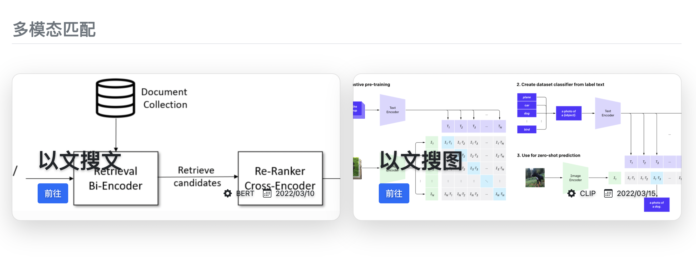

# 多模态检索 Demo — 线上服务

多模态检索 Demo 线上服务，同时支撑**以文搜文**、**以文搜图**等应用场景，整套线上服务由以下几部分构成：

1. [multimodal_web](multimodal_web)，检索前端服务，提供 web UI 界面供用户体验多模态检索能力
2. [multimodal_serving](multimodal_serving)，多模态示例的算法服务，含有实验配置、预处理、召回、排序等整个算法处理链路
3. [multimodal_preprocess](multimodal_preprocess)，对多模态大模型预处理逻辑（含文本/图像等）的封装，以 gRPC 接口提供服务

从用户请求视角看，以上几个服务从前往后依次形成调用依赖关系。所以要把多模态 Demo 搭建起来，就需要**从后往前**依次把各个服务先跑起来。当然做这些之前，要记得先把[离线](../offline)的模型导出、上线和建库先搞定哈！

当把上述服务运行起来后，就得到一个完整的多模态检索服务，拿**百科问答以文搜文**为例，运行效果如下：

<p align="center">
   
</p>

接下来，我们将详细描述如何把各个线上服务搭建起来，内容安排如下：

- [prepare](#0-prepare)
- [multimodal_preprocess](#1-multimodal_preprocess)
  - [启动](#11-启动)
  - [测试](#12-测试)
- [multimodal_serving](#2-multimodal_serving)
  - [启动](#21-启动)
  - [测试](#22-测试)
- [multimodal_web](#3-multimodal_web)
  - [启动](#31-启动)
  - [测试](#32-测试)

## 0. prepare

准备工作主要有：

- **数据建库**并把索引数据推送到服务组件中（如：Milvus/MongoDB等）
- **模型导出**并把模型推送到服务组件中（如：MetaSpore Serving/multimodal_preprocess等）

更多离线准备工作细节，见[参考文档](../offline)。

## 1. multimodal_preprocess

NLP/CV 数据往往需要[预处理](https://huggingface.co/docs/transformers/preprocessing)后再送入线上推理模型，该服务主要对 HuggingFace NLP/CV 相关的预处理逻辑封装，提供 gRPC 服务接口。

该服务被在线算法服务 `multimodal_serving` 中的 query 预处理模块（QP）依赖，用户请求到达在线算法服务后会被转发到该服务完成数据预处理，然后在线算法服务继续后续的处理。

更多关于服务接口和代码参见[预处理服务](multimodal_preprocess)。

### 1.1 启动

服务启动+模型载入操作如下：

```bash
cd online/multimodal_preprocess

pip install -r requirements.txt

# 启动预处理服务
# start hf_preprocess service, listening on 60051 port
sh server.sh

# 从 S3 下载预处理模型，并推送到预处理服务中
# push tokenizer model into hf_preprocess service
model_name=sbert-chinese-qmc-domain-v1
MY_S3_PATH='your S3 bucket'

aws s3 cp ${MY_S3_PATH}/demo/nlp-algos-transformer/models/sbert-chinese-qmc-domain-v1/sbert-chinese-qmc-domain-v1.tar.gz ./

python client.py push ${model_name} ./sbert-chinese-qmc-domain-v1.tar.gz
```

### 1.2 测试

当上述步骤完成后，就可调用测试：

```bash
python client.py tokenize ${model_name} 我在中国北京
```

返回结果如下：

```
Client received: payload={'attention_mask': [[1, 1, 1, 1, 1, 1, 1, 1]], 'input_ids': [[101, 2769, 1762, 704, 1744, 1266, 776, 102]], 'token_type_ids': [[0, 0, 0, 0, 0, 0, 0, 0]]}, extras={'msg': 'ok', 'status': '0'}
```

## 2. multimodal_serving

这个服务是在线算法的整套 pipeline，同时支撑**以文搜文**、**以文搜图**等应用场景，涵盖了 query 预处理、召回、排序、摘要等几个模块。整个项目在 SpringBoot+K8S 框架上开发，接下来将说明如何配置环境把这套在线算法服务搭建起来，并在搭建完成后给出一个测试用例。

### 2.1 启动

一、安装 online-serving 组件

首先， 我们需要使用 `maven` 来安装 [online-serving 组件](../../../java/online-serving/README-CN.md)：

1. `MetaSpore Serving` 用来做模型的实时推理，所有线上需要模型实时推理预测的工作都需要访问这个服务，更多信息参见[客户端说明文档](../../../java/online-serving/serving)；

2. `feature-extract` 是一个 maven 的插件，用来通过[特征描述文件](multimodal_serving/src/main/resources/tables)，自动生成从 `MongoDB` 访问特征的API，更多信息可以[参考链接](../../../java/online-serving/feature-extract/README-CN.md)；

3. `experiment-pipeline` 是 A/B 实验框架，能够帮助我们更方便的部署A/B实验，支持热部署等特性，更多信息可以[参考链接](../../../java/online-serving/experiment-pipeline/README-CN.md)。

安装时，需要执行以下命令

```shell
cd MetaSpore/java/online-serving

mvn clean install 
```

二、建立 application-dev.properties

我们需要从模版文件[application-template.properties](multimodal_serving/src/main/resources/application-template.properties) 创建一个 resources/**application-dev.properties** 文件，主要用来配置：

1. `MongoDB` 服务的相关配置；
2. `MetaSpore Serving` 服务的相关配置；
3. `Hf Preprocessor` 预处理服务的相关配置；
4. `Milvus` 服务的相关配置；
5. 其他服务，例如 `MySQL` 相关的配置可以忽略，我们在这个项目中暂时还未用到。

文件创建好写入相关配置信息后，放在 `multimodal_serving/src/main/resources` 目录中即可。

三、安装和配置 Consul

我们可以通过更改 `Consul` 中的 Key/Value 的字典值，实时更改在线的 A/B 实验的策略，具体安装和配置的方法：

1. [下载并安装Consul](https://www.consul.io/downloads)，打开应用程序；
2. 打开Consul的[链接](http://localhost:8500/ui/dc1/kv), 默认端口是`8500`，如果遇到问题，可以查看是否存在端口占用的情况。创建一个新的 Key/Value 字典对:
   1. Key 是 `config/test/multimodal-config`
   2. 拷贝 [YAML 配置文件](multimodal_serving/src/main/resources/experiment.yaml) 这个文件中的内容作为 Value. 
   3. 在我们的Demo项目中，Consul 的[配置文件在这里](multimodal_serving/src/main/resources/bootstrap.yml).

Consul 配置文件有如下标黄几点要重点关注：

<p align="center">
   
</p>

四、启动在线服务

当以上的配置工作都完成之后，我们可以从 [MultiModalRetrievalApplication.java](multimodal_serving/src/main/java/com/dmetasoul/metaspore/demo/multimodal/MultiModalRetrievalApplication.java) 服务入口，启动我们的应用。

### 2.2 测试

在线算法服务启动后就可以进行测试啦！举例来说，对于 `userId=10` 的用户，想要查询 `如何补办身份证`，可以访问**以文搜文**的百科问答服务：

```bash
curl -H "Content-Type: application/json" -X POST -d '{"query":"如何补办身份证"}' http://localhost:8080/qa/user/10
```

可以得到如下检索结果：

```json
{
  "queryModel" : {
    "query" : "如何补办身份证"
  },
  "searchItemModels" : [ [ {
    "id" : "823067",
    "originalRetrievalScoreMap" : {
      "ann_matcher" : 0.9867960810661316
    },
    "finalRetrievalScore" : 3.9989876453053745,
    "originalRankingScoreMap" : {
      "dummy" : 3.9989876453053745
    },
    "finalRankingScore" : 3.9989876453053745,
    "score" : 3.9989876453053745,
    "summary" : {
      "question" : "怎样补办身份证 ",
      "answer" : "去户口所在地的公安局办理 <br/>",
      "category" : [ "生活", "美容/塑身", "化妆" ]
    }
  }, {
    "id" : "449327",
    "originalRetrievalScoreMap" : {
      "ann_matcher" : 0.8193722367286682
    },
    "finalRetrievalScore" : 3.8294953304980894,
    "originalRankingScoreMap" : {
      "dummy" : 3.8294953304980894
    },
    "finalRankingScore" : 3.8294953304980894,
    "score" : 3.8294953304980894,
    "summary" : {
      "question" : "身份证丢了，该怎样补办呢？身份证丢了，而我在异地，该怎么补办？ ",
      "answer" : "我有过此种经历，身份证的办理要到户口所在地办理，如果你在外地，不便回去的话，去照两张身份证照片用特快传递寄回去，找一个可靠的人帮你去户口所在地派出所办理就行（一般50元）还有什么问题尽管说，我会帮你的！！",
      "category" : [ "生活", "生活常识" ]
    }
  }, {
    "id" : "999798",
    "originalRetrievalScoreMap" : {
      "ann_matcher" : 0.8182893991470337
    },
    "finalRetrievalScore" : 3.8283991147888043,
    "originalRankingScoreMap" : {
      "dummy" : 3.8283991147888043
    },
    "finalRankingScore" : 3.8283991147888043,
    "score" : 3.8283991147888043,
    "summary" : {
      "question" : "身份证丢了如何补办？需要什么证件、手续，谢！ ",
      "answer" : "居民身份证补办<br/>1、补领居民地点：<br/>     公民办理遗失补领居民身份证地点为其户口所在地派出所。　  <br/>2、公民补领居民身份证时需要交验的手续及步骤：<br/>   第一步：<br/>    公民办理遗失补领居民身份证应向其户口所在地派出所交验以下证明证件：<br/>    (1) 本人居民户口簿；<br/>    (2) 单位或所在街道、乡镇出具的证明；<br/>    (3) 本人近期正面免冠一寸光纸黑白大头照片两张（经常戴眼镜的公民应交戴眼镜的照片）。<br/>    居民身份证像片标准：照片规格 32mm*22mm (一英寸)<br/>               头部宽度：约为18mm。头部两侧距相片左右两边各为2mm。<br/>               头部长度：约为26mm。头顶发际距相片上边1mm，下颌距相片下边5mm。<br/>    第二步：<br/>    填写补领居民身份证的登记表格<br/> <br/>到公民户口所在地派出所领取制作完成的居民身份证。<br/><br/><br/>办理临时身份证<br/>1、临时身份证办理地点：<br/>  公民用于办理乘飞机车船手续，急需申办临时身份证的应向其户口所在地派出所提出书面申请并交验证明证件后，由派出所开具证明，到户口所在地公安分(县)局户籍接待室办理。  <br/>2、公民办理临时身份证时需要交验的手续：<br/>  公民办理临时身份证应向其户口所在地派出所提出书面申请并交验以下证明证件：<br/>  (1)本人居民户口簿；<br/>  (2)单位或所在街道、乡镇出具证明；<br/>  (3)本人近期正面免冠一寸光纸黑白大头照片两张（经常戴眼镜的公民应交戴眼镜的照片）。<br/>   居民身份证像片标准：照片规格 32mm*22mm (一英寸)<br/>               头部宽度：约为18mm。头部两侧距相片左右两边各为2mm。<br/>               头部长度：约为26mm。头顶发际距相片上边1mm，下颌距相片下边5mm。  <br/>到公民户口所在地公安分(县)局户籍接待室领取。<br/><br/><br/>",
      "category" : [ "社会民生", "法律" ]
    }
  } ] ]
}
```

## 3. multimodal_web

这个服务作为多模态检索的 UI 入口服务，提供了一个搜索输入条和展示搜索结果的页面，该服务会调用 `multimodal_serving` 服务并把返回结果展示到页面中。

### 3.1 启动

该服务基于 [Flask](https://flask.palletsprojects.com/en/2.1.x/) 框架开发，十分轻量，安装和启动也很方便：

```bash
cd online/multimodal_web

pip install -r requirements.txt

sh start.sh
```

### 3.2 测试

启动完成后，前往 `http://127.0.0.1:8090` 去查看搜索 UI 服务是否运行正常，结果如下：

<p align="center">
   
</p>

点击入口链接就可以进入对应的检索 demo 啦！