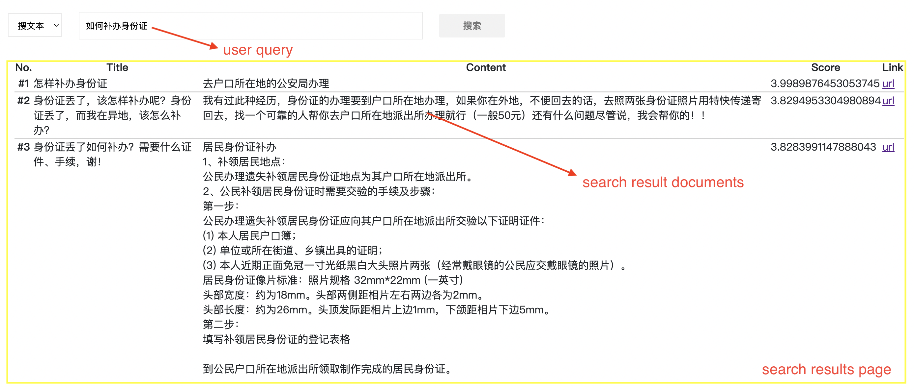
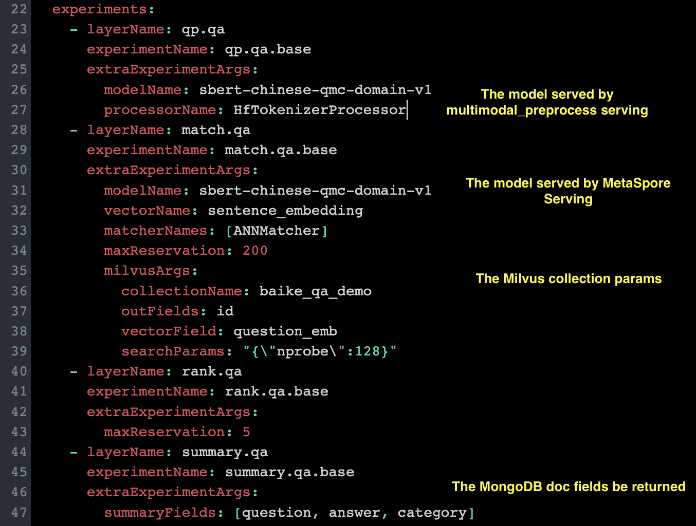

## [中文介绍](README-CN.md)

# Multimodal Retrieval Demo — Online Services

The Multimodal Retrieval Demo online service, while supporting application scenarios such as text-to-text search, text-to-image search, etc. It consists of the following parts:

1. [multimodal_web](multimodal_web), a front-end service for multimodal demo, providing a web UI interface for users to experience multimodal retrieval service.
2. [multimodal_serving](multimodal_serving), retrieval online service for multimodal demo, including the entire algorithm pipeline such as a/b experimental configuration, query preprocessing, matching, ranking, summary, etc.
3. [multimodal_preprocess](multimodal_preprocess), wrap the multimodal pretrained model preprocessing methods (including text/image, etc.), and provides service through the gRPC api.

**Note:** The above services form dependencies in sequence from front to back, so to build a multimodal demo, you need to run each service in sequence from back to front. Of course, before doing this, remember to take done the [offline](../offline) part.

When you setup the above services, an end-to-end multimodal retrieval service will be obtained. Take **Q&A text-to-text** as an example, the demo search results as following:



Next, we will describe in detail how to build those online services step by step.

- [prepare](#0-prepare)
- [multimodal_preprocess](#1-multimodal_preprocess)
  - [Setup](#11-Setup)
  - [Test](#12-Test)
- [multimodal_serving](#2-multimodal_serving)
  - [Setup](#21-Setup)
  - [Test](#22-Test)
- [multimodal_web](#3-multimodal_web)
  - [Setup](#31-Setup)
  - [Test](#32-Test)


## 0. offline prepare

Please go [here](../offline) to prepare the demo offline processing includes:

- database indexing and push to online services like `Milvus`, `MongoDB`
- model export and push to online services like `MetaSpore Serving`, `mulitmodal_preprocess`

## 1. multimodal_preprocess

NLP/CV multi-modal data often requires [preprocessing](https://huggingface.co/docs/transformers/preprocessing) before being sent to the online inference model. This service encapsulates the preprocessing methods related to HuggingFace NLP/CV and provides the gRPC service api.

This service is depended on by the query preprocessing module (QP) in the online algorithm service `multimodal_serving`. After the user request reaches the online algorithm service, it will be forwarded to this service to preprocess data.

**Note**: the above preprocessing model tokenizer has been pushed to S3 in the [QA offline](../offline/QA/index_and_export) part.

### 1.1 Setup

Start service and push preprocessing model:

```bash
cd online/multimodal_preprocess

pip install -r requirements.txt

# start hf_preprocess service, listening on 60051 port
sh server.sh

# download from S3 then push tokenizer model into hf_preprocess service
model_name=sbert-chinese-qmc-domain-v1
MY_S3_PATH='your S3 bucket'
aws s3 cp ${MY_S3_PATH}/demo/nlp-algos-transformer/models/sbert-chinese-qmc-domain-v1/sbert-chinese-qmc-domain-v1.tar.gz ./

python client.py push ${model_name} ./sbert-chinese-qmc-domain-v1.tar.gz
```

### 1.2 Test

When the service is started, we can test as follows:

```bash
python client.py tokenize ${model_name} 我在中国北京
```

Results:

```
Client received: payload={'attention_mask': [[1, 1, 1, 1, 1, 1, 1, 1]], 'input_ids': [[101, 2769, 1762, 704, 1744, 1266, 776, 102]], 'token_type_ids': [[0, 0, 0, 0, 0, 0, 0, 0]]}, extras={'msg': 'ok', 'status': '0'}
```

## 2. multimodal_serving

This service is the pipeline of online algorithms, and supports application scenarios such as **text-to-text search** and **text-to-image** search, covering several modules such as query preprocessing, matching, ranking, and summarization. This project is developed on the SpringBoot+K8S framework. Next, I will explain how to configure the environment to build this online algorithm service.

### 2.1 Setup

**(1)** Install online-serving components

You need to maven install [online-serving](../../../java/online-serving) components 
before launching our online recommend service.

1. `MetaSpore Serving` is used to do model inference. [Serving client docs](../../../java/online-serving/serving).
2. `feature-extract` is a maven plugin which generate domains and repositories of MongoDB using its [table yaml files](multimodal_serving/src/main/resources/tables). [More information](../../../java/online-serving/feature-extract/README.md)
3. `experiment-pipeline` is an experiment framework which help us do A/B testing more easily. [More information](../../../java/online-serving/experiment-pipeline/README.md).
```
cd MetaSpore/java/online-serving
mvn clean install 
```

**(2)** Create application-dev.properties

You need to create resources/**application-dev.properties** from [application-template.properties](multimodal_serving/src/main/resources/application-template.properties) and specify:

1. `MongoDB` related configurations. 
2. `MetaSpore Serving` related configurations.
2. `Hf Preprocessor` related configurations
3. `Milvus` related configurations.
4. (Just ignore mysql configurations. We don't use it in this demo but we support multi data sources.)

Then put this file into `multimodal_serving/src/main/resources` directory.

**(3)** Install and configure Consul

You could modify Consul's Key/Value pair to dynamically change the online A/B testing strategies.

1. [Install Consul](https://www.consul.io/downloads) and launch it.
2. Visit Consul's [portal](http://localhost:8500/ui/dc1/kv), and create a new Key/Value pair:
   1. Key is `config/test/multimodal-config`
   2. Copy this [YAML content](multimodal_serving/src/main/resources/experiment.yaml) as value. 
   3. The config file of Consul of our demo is [here](multimodal_serving/src/main/resources/bootstrap.yml).

There are some highlights should be noted:



**(4)** Launch recommend online service

You could run online service via entry point ([MultiModalRetrievalApplication.java](multimodal_serving/src/main/java/com/dmetasoul/metaspore/demo/multimodal/MultiModalRetrievalApplication.java) ).

### 2.2 Test

For example, user (`userId=10`) search by `query="如何补办身份证"` in our QA text-to-text demo, make a request as following

```bash
curl -H "Content-Type: application/json" -X POST -d '{"query":"如何补办身份证"}' http://localhost:8080/qa/user/10
```

Then get results:

```json
{
  "queryModel" : {
    "query" : "如何补办身份证"
  },
  "searchItemModels" : [ [ {
    "id" : "823067",
    "originalRetrievalScoreMap" : {
      "ann_matcher" : 0.9867960810661316
    },
    "finalRetrievalScore" : 3.9989876453053745,
    "originalRankingScoreMap" : {
      "dummy" : 3.9989876453053745
    },
    "finalRankingScore" : 3.9989876453053745,
    "score" : 3.9989876453053745,
    "summary" : {
      "question" : "怎样补办身份证 ",
      "answer" : "去户口所在地的公安局办理 <br/>",
      "category" : [ "生活", "美容/塑身", "化妆" ]
    }
  }, {
    "id" : "449327",
    "originalRetrievalScoreMap" : {
      "ann_matcher" : 0.8193722367286682
    },
    "finalRetrievalScore" : 3.8294953304980894,
    "originalRankingScoreMap" : {
      "dummy" : 3.8294953304980894
    },
    "finalRankingScore" : 3.8294953304980894,
    "score" : 3.8294953304980894,
    "summary" : {
      "question" : "身份证丢了，该怎样补办呢？身份证丢了，而我在异地，该怎么补办？ ",
      "answer" : "我有过此种经历，身份证的办理要到户口所在地办理，如果你在外地，不便回去的话，去照两张身份证照片用特快传递寄回去，找一个可靠的人帮你去户口所在地派出所办理就行（一般50元）还有什么问题尽管说，我会帮你的！！",
      "category" : [ "生活", "生活常识" ]
    }
  }, {
    "id" : "999798",
    "originalRetrievalScoreMap" : {
      "ann_matcher" : 0.8182893991470337
    },
    "finalRetrievalScore" : 3.8283991147888043,
    "originalRankingScoreMap" : {
      "dummy" : 3.8283991147888043
    },
    "finalRankingScore" : 3.8283991147888043,
    "score" : 3.8283991147888043,
    "summary" : {
      "question" : "身份证丢了如何补办？需要什么证件、手续，谢！ ",
      "answer" : "居民身份证补办<br/>1、补领居民地点：<br/>     公民办理遗失补领居民身份证地点为其户口所在地派出所。　  <br/>2、公民补领居民身份证时需要交验的手续及步骤：<br/>   第一步：<br/>    公民办理遗失补领居民身份证应向其户口所在地派出所交验以下证明证件：<br/>    (1) 本人居民户口簿；<br/>    (2) 单位或所在街道、乡镇出具的证明；<br/>    (3) 本人近期正面免冠一寸光纸黑白大头照片两张（经常戴眼镜的公民应交戴眼镜的照片）。<br/>    居民身份证像片标准：照片规格 32mm*22mm (一英寸)<br/>               头部宽度：约为18mm。头部两侧距相片左右两边各为2mm。<br/>               头部长度：约为26mm。头顶发际距相片上边1mm，下颌距相片下边5mm。<br/>    第二步：<br/>    填写补领居民身份证的登记表格<br/> <br/>到公民户口所在地派出所领取制作完成的居民身份证。<br/><br/><br/>办理临时身份证<br/>1、临时身份证办理地点：<br/>  公民用于办理乘飞机车船手续，急需申办临时身份证的应向其户口所在地派出所提出书面申请并交验证明证件后，由派出所开具证明，到户口所在地公安分(县)局户籍接待室办理。  <br/>2、公民办理临时身份证时需要交验的手续：<br/>  公民办理临时身份证应向其户口所在地派出所提出书面申请并交验以下证明证件：<br/>  (1)本人居民户口簿；<br/>  (2)单位或所在街道、乡镇出具证明；<br/>  (3)本人近期正面免冠一寸光纸黑白大头照片两张（经常戴眼镜的公民应交戴眼镜的照片）。<br/>   居民身份证像片标准：照片规格 32mm*22mm (一英寸)<br/>               头部宽度：约为18mm。头部两侧距相片左右两边各为2mm。<br/>               头部长度：约为26mm。头顶发际距相片上边1mm，下颌距相片下边5mm。  <br/>到公民户口所在地公安分(县)局户籍接待室领取。<br/><br/><br/>",
      "category" : [ "社会民生", "法律" ]
    }
  } ] ]
}
```

**Note**: About model online inference, you can find a piece of code `modelName: sbert-chinese-qmc-domain-v1` in the [experiment.yaml](multimodal_serving/src/main/resources/experiment.yaml) config file. This is the model unique key in our [MetaSpore Serving](https://github.com/meta-soul/MetaSpore), the model has been exported to S3 in the [QA offline](../offline/QA/index_and_export) part and MetaSpore Serving will load it from S3.

## 3. multimodal_web

This is the UI entry service for multimodal retrieval. It provides a search bar and a page for displaying search results. This service will call the `multimodal_serving` service and display the returned results on the page, so remember start `multimodal_serving` first.

### 3.1 Setup

The service is developed based on the [Flask](https://flask.palletsprojects.com/en/2.1.x/) framework, which is very lightweight and easy to install and start:

```bash
cd online/multimodal_web

pip install -r requirements.txt

sh start.sh
```

### 3.2 Test

Go  `http://127.0.0.1:8090` to check the UI service!

