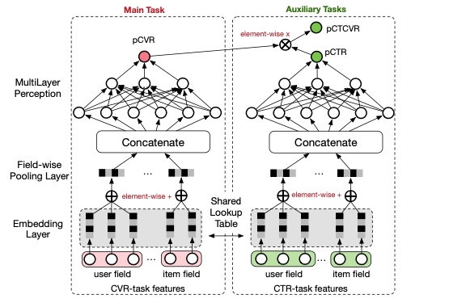

# Multi-Task ESMM Demo

<p align="center">
   
</p>

[Entire Space Multi-Task Model: An Effective Approach for Estimating Post-Click Conversion Rate (ESMM)](https://arxiv.org/pdf/1804.07931.pdf) 是一种多任务学习网络，可以同时学习点击率 (CTR) 和转化率 (CVR)。借助于 CTR 和 CTCVR 两个辅助任务的学习，ESMM 可以在电商场景的 CVR 学习过程中克服 SSB 和数据稀疏的挑战。在这个Demo中，我们会实现 ESMM 模型，使用 [Ali-CCP](https://tianchi.aliyun.com/dataset/dataDetail?dataId=408) 数据集训练模型，并展示训练结果。

## 测试结果
|      数据集      | pCTCVR AUC | pCVR AUC | pCTR AUC | Epochs |
|:-------------:|:----------:|:--------:|:--------:|:------:|
| Ali-CCP Large |  `0.6296`  | `0.6429` | `0.5731` |   3    |
| Ali-CCP Small |  `0.5897`  | `0.5552` | `0.5355` |   5    |

## 如何运行
### Initialize the configuration files for models
首先, 上传 [schema](schema) 到S3云存储。然后通过替换对应YAML模板中的变量，初始化我们需要的模型配置文件。假设我们在项目的根目录，举例来说:

```shell
export MY_S3_BUCKET='your S3 bucket directory'
envsubst < conf/esmm_aliccp_10w.template.yaml > conf/esmm_aliccp_10w.yaml 
```

### 训练模型
假设我们在项目的根目录，我们现在可以运行以下的训练脚本：

```shell
cd esmm/
python esmm.py --conf conf/esmm_aliccp_10w.yaml
```
