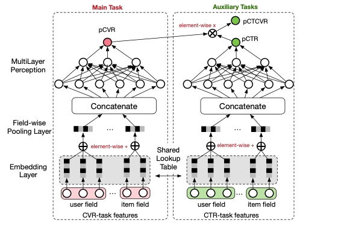

## [中文介绍](README-CN.md)

# Multi-Task ESMM Demo

<p align="center">
   
</p>

[Entire Space Multi-Task Model: An Effective Approach for Estimating Post-Click Conversion Rate (ESMM)](https://arxiv.org/pdf/1804.07931.pdf) is a Multi-task learning structure that can model click through rate(CTR) and conversion rate(CVR) simultaneously. With the help of two auxiliary tasks of CTR and CTCVR, ESMM tackles challenges of sample selection bias and data sparsity for CVR modeling encountered in e-commerce scenarios.In this demo, we will implement the ESMM model, and give the benchmarks of Ali-CCP dataset.

## Benchmarks
|    Dataset    | pCTCVR AUC | pCVR AUC | pCTR AUC | Epochs |
|:-------------:|:----------:|:--------:|:--------:|:------:|
| Ali-CCP Large |  `0.6296`  | `0.6429` | `0.5731` |   3    |
| Ali-CCP Small |  `0.5897`  | `0.5552` | `0.5355` |   5    |

## How to run
### Initialize the configuration files for models
Firstly, upload the [schema](schema) files onto you S3 storage.
Then initialize the config files from their `YAML` template for substituting some variables. Suppose we are in root directory of this project, for example:
```shell
export MY_S3_BUCKET='your S3 bucket directory'
envsubst < conf/esmm_aliccp_10w.template.yaml > conf/esmm_aliccp_10w.yaml 
```

### Train model
Suppose we are in root directory of this project, we could run the training script now:
```shell
cd esmm/
python esmm.py --conf conf/esmm_aliccp_10w.yaml
```
