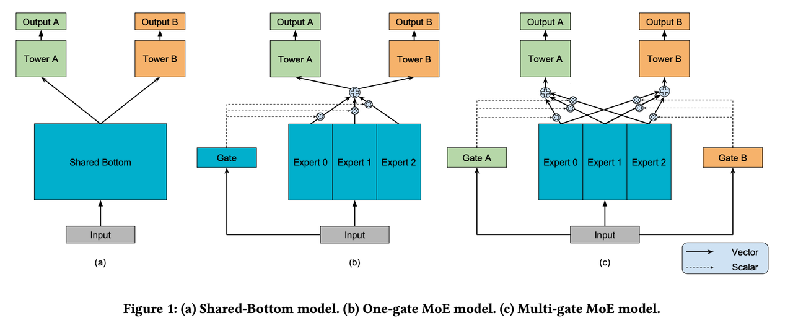

# 多任务MMoE模型的演示

<center></center>

[Multi-gate Mixture-of-Experts (MMoE)](https://www.kdd.org/kdd2018/accepted-papers/view/modeling-task-relationships-in-multi-task-learning-with-multi-gate-mixture-)
是一种多任务学习结构。它显式地学习了从数据中建模任务之间的关系。作者通过共享所有任务的专家子模型，修改传统 Mixture-of-Experts (MoE) 结构，
使其可以进行多任务学习，同时还训练了一个门控网络来优化每个任务。

在这个演示中，我们实现了 MMoE 模型，并给出了在Census数据集上的评测结果。

## 基准
|  数据集   |                             marital_stat (首要任务) |                               income_50k (次要任务) | 训练轮数 |
|:------:|------------------------------------------------:|------------------------------------------------:|-----:|
| Census | Train AUC:  `0.9827` <br /> Test AUC:  `0.9823` | Train AUC:  `0.8611` <br /> Test AUC:  `0.8627` |  100 |

## 如何运行

### 数据预处理
在这一节, 我们使用人口统计公开集 [Census](https://archive.ics.uci.edu/ml/machine-learning-databases/census-income-mld/census.tar.gz) 作为我们Demo的数据集.
```shell
cd census
sh data_process.sh
```
我们提取出 'marital_stat' 以及 'income_50k' 作为多任务模型的两个标签。并且对连续型特征做如下变换:
```python
import numpy as np
def fun3(x):
    return np.log(x+1).astype(int)
```
此外, 我们无需对离散型特征取one-hot编码，因为MetaSpore会自动处理模型的Embedding层。

### 初始化模型配置文件
首先, 上传 [schema](schema) 到你的S3云存储。
然后通过替换对应`YAML`模板中的变量，初始化我们需要的模型配置文件，举例来说:
```shell
export MY_S3_BUCKET='your S3 bucket directory'
envsubst < mmoe.template.yaml > mmoe.yaml 
```

### 训练模型
现在我们可以运行训练脚本了:
```shell
cd MetaSpore/demo/multitask/mmoe
python mmoe.py --conf conf/mmoe.yaml 
```