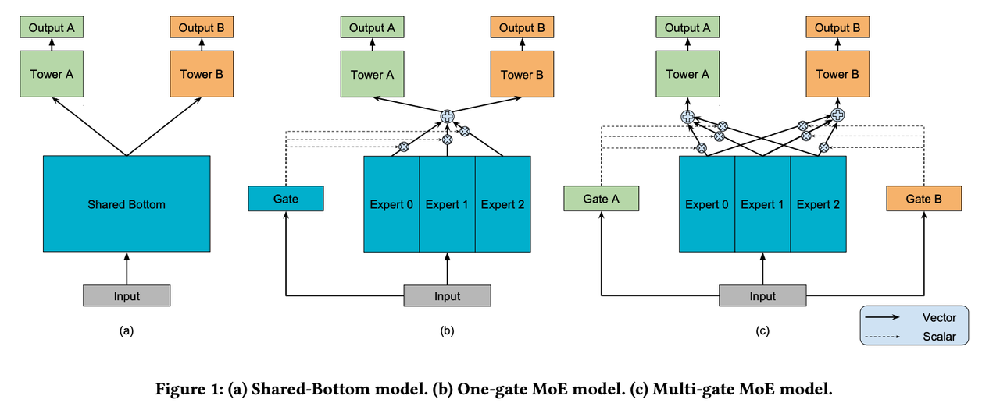

## [中文介绍](README-CN.md)

# Multi-Task MMoE Demo
<center></center>

[Multi-gate Mixture-of-Experts (MMoE)](https://www.kdd.org/kdd2018/accepted-papers/view/modeling-task-relationships-in-multi-task-learning-with-multi-gate-mixture-)
is a Multi-task learning structure. It explicitly learns to model task 
relationships from data. The author adapt the Mixture-of-Experts (MoE) structure to Multi-task learning by sharing the
expert sub-models across all tasks, while also having a gating network trained to optimize each task.

In this demo, we will implement the MMoE model, and give the benchmarks of Census dataset.

## Benchmarks
| Dataset |                     marital_stat (primary task) |                     income_50k (secondary task) | epoch |
|:-------:|------------------------------------------------:|------------------------------------------------:|------:|
| Census  | Train AUC:  `0.9827` <br /> Test AUC:  `0.9823` | Train AUC:  `0.8611` <br /> Test AUC:  `0.8627` |   100 |

## How to run

### Data preprocessing
In this section, we use the publicly available dataset [Census](https://archive.ics.uci.edu/ml/machine-learning-databases/census-income-mld/census.tar.gz) as our demo dataset. 
```shell
cd census
sh data_process.sh
```
We extract 'marital_stat' and 'income_50k' as two labels of multitask model. And transform continuous features using:
```python
import numpy as np
def fun3(x):
    return np.log(x+1).astype(int)
```
Moreover, we don't need to transform categorical features to one-hot embeddings because MetaSpore can handle embedding layer automatically.

### Initialize the configuration files for models
First, upload the [schema](schema) to you S3 storage.
Then initialize the config files from their `YAML` template for substituting some variables. For example:
```shell
export MY_S3_BUCKET='your S3 bucket directory'
envsubst < mmoe.template.yaml > mmoe.yaml 
```

### Train model
We could run the training script now:
```shell
cd MetaSpore/demo/multitask/mmoe
python mmoe.py --conf conf/mmoe.yaml 
```