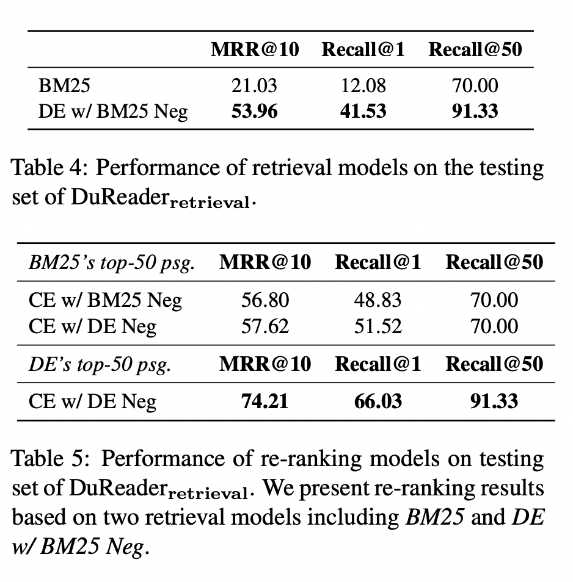

# 一、简介

**文本检索**是通用/垂类搜索、问答、客服等场景中要解决的基础性问题，一旦文本检索技术把文本到文本之间的语义桥梁搭建起来，许多跟文本处理相关的应用场景都将受益。真实应用场景下，文本检索要处理的数据规模往往非常大，比如电商搜索的商品库达十亿级别、通用搜索要处理十万亿级的网页数据，因此为考虑**性能**和**精度**之间的权衡，文本检索方法往往会拆解为**召回和排序两阶段**来实现。在**召回**阶段，需要从大规模文档库中快速高效的筛选出百千级别的候选文档集。而在**排序**阶段则可以使用更丰富的特征、更复杂的模型来对召回候选文档集进行精细化排序。正是基于召回阶段的高性能和排序阶段的高精度，才使得文本检索系统能够满足真实业务场景下对性能和精度的苛刻要求。

我们这里重点关注文本检索系统中的模型迭代优化以及模型在线推理工程架构等核心技术难点。模型迭代优化方面，我们将实践前沿的**低维稠密向量召回**和**深度语义排序**方法，并在业界开放的权威[数据集](https://aistudio.baidu.com/aistudio/competition/detail/157/0/introduction)上进行效果验证。模型在线推理方面，我们将从离线的蒸馏、裁剪等模型轻量化角度入手，并结合 [MetaSpore Serving](https://github.com/meta-soul/MetaSpore) 来提升模型在线推理性能。

# 二、数据集

我们的语义向量召回和深度语义排序模型都是基于工业界真实的开放数据集—[DuReaderRetrieval](https://aistudio.baidu.com/aistudio/competition/detail/157/0/introduction)进行优化的。主要考虑到该数据集有几个优势：

- 来源于百度搜索真实业务场景
- 中文领域高质量且大规模的段落检索数据集
- 投入大量人工标注资源改善了评测集质量

通过对数据集的分析和洞察，发现该数据集有以下几个特点：

- query 查询词较短，平均不到 10 个字符，可利用信息有限
- passage 检索库规模较大，检索库大约有 809 万条数据，并且平均文本长度将近 400 个字符
- 训练数据仅含有正样本，也即只有 `(query, pos_passage)` 数据，至于负样本需要自己挖掘构造
- 训练数据集含有大量伪负例，由于人工标注数据时不可能将所有正样本标注出来，因此如果默认未标注为正样本的就是负样本的话，就存在大量伪负例（开发集经过人工标注二次改善后每个 query 有 4.93 个正样本，而训练集仅含有 2.57 个正样本）

我们将会结合以上数据集的特点来设计后续的模型迭代优化策略，并深入探索负样本挖掘以及难负样本去噪的技术来克服数据集的缺陷。

附：数据集统计结果

|        | query 总量 | passage 总量 | passage 平均量 | query 平均长度 | passage 平均长度 |
| ------ | ---------- | ------------ | -------------- | -------------- | ---------------- |
| 训练集 | 86395      | 222395       | 2.57           | 9.51           | 362.6            |
| 验证集 | 2000       | 9863         | 4.93           | 9.28           | 387.64           |

数据集可以通过脚本来自动获取，进入模型优化之前需要先下载该数据集：

```bash
sh data/download.sh
```

# 三、基线模型

我们将百度官方发布的 [RocketQA Baseline](https://github.com/PaddlePaddle/RocketQA/tree/main/research/DuReader-Retrieval-Baseline) 来作为对照的基线模型，官方给出了召回和排序两个基线模型在**验证集**上的评测效果：

| Model |  MRR@10 | recall@1 | recall@50 |
| --- | --- | --- | --- |
| dual-encoder (retrieval) | 60.45 | 49.75 | 91.75|
| cross-encoder (re-ranking) | 72.84 | 64.10 | 91.75|

其中几个评测指标，MRR@10 和 recall@1 更加关注正样本能否排在较靠前的位置，而 recall@50 则更关注正样本能否进入到前 50 个位置，因此前者更适合度量排序模型的效果，后者则更适合度量召回模型的效果。

> Recall@50 is more suitable for evaluating the firststage retrievers, while MRR@10 and Recall@1 are more suitable for assessing the second-stage re-rankers.

我们还验证了未经过检索任务微调训练的通用语义表征[模型](https://huggingface.co/DMetaSoul/sbert-chinese-general-v2)在该任务上的表现，发现效果较差（MRR@10=7.78%, recall@1=4.3%, recall@50=29.65%），语义表征模型的跨领域迁移能力较弱，需要在检索任务上调优训练才行。

此外 DuReaderRetrieval [数据集文献](https://arxiv.org/pdf/2203.10232.pdf)中还给出了其它一些基线模型在**测试集**（并未开放）上的评测效果（DE 全称 DualEncoder，CE 全称 CrossEncoder）：



其中 Table-4 记录了 BM25 以及结合难负样本挖掘的 DE 模型召回效果，向量召回相比文本召回提升 21.33% (70.00->91.33%)；Table-5 记录了通过 CE 排序模型对 BM25 召回候选或者 DE 召回候选排序后的效果，可见用 DE 做召回再结合 CE 排序取得效果是最优的。由于官方并没有开放测试集，所以这里公布的模型效果可作为辅助参考来指导后续模型迭代。

# 四、模型优化

由于检索问题将被拆分为召回和排序两阶段来解决，相应的模型优化工作也集中在这两部分。召回模型我们将采用经典的非对称双塔结构，结合负样本挖掘策略以及模型轻量化手段来提升模型的召回效果和性能。排序模型我们将采用基于 BERT 类预训练模型的深度语义排序模型。

在模型优化之前首先需要把数据集创建好，执行如下命令：

```bash
# make train data for point/pair/list-wise loss
sh script/make_train_data.sh

# make the training running time evaluation data
sh script/make_eval_data.sh
```

## 4.1 召回模型

传统的文本检索系统基于 TFIDF/BM25 等**高维稀疏字面匹配**算法来实现，这类方法的主要缺陷在于，当字面表达不一致但表达语义一致时，字面匹配算法就失效了。近年来随着深度表征学习的崛起，基于**低维稠密向量匹配**方法也逐渐引入到文本检索系统当中，这类方法一般采用 dual-encoder 双塔模型结构来分别对 query 和 passage 进行向量表示，离线训练时优化目标希望语义相同的数据能够在向量空间中靠近，而语义不同的数据希望在向量空间中远离。

结合具体的应用场景，召回模型的 dual-encoder 双塔可能是**对称**或者**非对称**结构，也即 query 和 passage 向量表示是否需要共享一个表征模型，当两侧语料分布较为一致时应该采用对称结构，否则应该采用非对称结构。对于 DuReaderRetrieval 任务来说，就应该采用非对称结构，不过我们在代码中为对称和非对称模式做了兼容处理，可以平滑切换到对称任务场景中。

目前我们迭代优化的召回模型在**验证集**上效果：

| Model        | MRR@10 | recall@1 | recall@50 |
| ------------ | ------ | -------- | --------- |
| In-batch-neg | 25.58  | 16.90    | 74.40     |

其中 `In-batch-neg` 是基于在线 in-batch 负采样策略训练的模型。

### 4.1.1 离线负采样

离线负采样的思路较为简单，在模型训练开始之前，进行全局随机采样得到负样本，这里需要控制一下正负样本比例，上述数据集构造过程就可以指定。这类方法的问题在于，全局随机采样可能得到的负样本都是很容易区分的负样本，召回模型缺乏对难负样本的识别能力，当然也可以结合难负样本挖掘策略来继续提升离线负采样的效果。

离线全局随机采样得到正负样本数据之后，可以通过 point-wise 或 pair-wise 等方式优化双塔召回模型，目前我们实现了以下几种优化方式：

- [CosineSimilarityLoss](./src/losses/cosine_similarity_loss.py)  双塔向量计算余弦相似度后跟 label 再计算 MSE 损失
- [ContrastiveLoss](./src/losses/contrastive_loss.py)  使正样本对的向量距离近，负样本对的向量距离远
- [TripletLoss](./src/losses/triplet_loss.py)  利用 `(query, pos, neg)` 形式数据，使得正样本要比对应负样本距离 query 更近

可通过类似这种方式来启动模型训练：

```python
python src/train/train_dual_encoder.py --name train_de_loss_cosine \
    --model DMetaSoul/sbert-chinese-general-v2 \
    --dual-model DMetaSoul/sbert-chinese-general-v2 \
    --num-epochs 2 \
    --lr 3e-05 \
    --loss cosine \
    --train-file data/train/train.rand.neg.pair.tsv \
    --train-kind pair_with_label \
    --train-text-index 0,1 \
    --train-label-index 2 \
    --train-batch-size 64 \
    --save-steps 10000 \
    --eval-qid-file data/dev/dev4eval.qid.tsv \
    --eval-pid-file data/dev/dev4eval.pid.tsv \
    --eval-rel-file data/dev/dev4eval.rel.tsv \
```

其中部分关键参数的作用说明如下：

- `--name` 标识这次训练的实验名称
- `--model` 双塔 query 侧的预训练模型
- `--dual-model` 双塔 passage 侧的预训练模型
- `--loss` 优化方式
- `--train-file` 训练数据文件
- `--train-kind` 训练数据的格式
- `--train-text-index` 训练文件中哪几列是输入文本
- `--train-label-index` 训练文件中哪列是标签
- `--tied-model` 如果需要使用对称双塔结构则指定这个参数，默认是非对称的结构

更多其它优化方式的启动命令，可以参考脚本 `script/train_dual_encoder.sh`。

模型训练开始后，日志、评测监控以及模型参数都被保存在 `output` 目录下，可以从这里查看模型训练状态。等模型训练完成之后，可以通过以下命令来评估模型在验证集上的效果：

```bash
# change to your model saved directory
q_model=output/train_de_loss_cosine/2022_05_27_21_16_29/epoch_1/model1
p_model=output/train_de_loss_cosine/2022_05_27_21_16_29/epoch_1/model2
query_file=./data/dev/dev.q.format
passage_data=./data/passage-collection
topk=50

# retrieval based passage database
sh script/retrieval.sh ${q_model} ${p_model} ${query_file} ${passage_data} ${topk}

# evaluate the retrieval results
sh script/eval_retrieval.sh
```

### 4.1.2 在线负采样

在线负采样的思路是，在训练时利用 batch 内其它样本作为负样本（in-batch negatives sampling），由于每次模型更新可以见到较多负样本，并且利用已经在显存中处理过的样本，因此这类方法的优点是训练收敛速度快且显存利用效率高。同时这类方法也可以结合难负样本挖掘策略来进一步提升效果。

目前我们已经支持了在线负采样模型优化，启动命令如下：

```bash
python -u src/train/train_dual_encoder.py --name train_de_loss_contrastive_in_batch \
    --model DMetaSoul/sbert-chinese-general-v2 \
    --dual-model DMetaSoul/sbert-chinese-general-v2 \
    --num-epochs 2 \
    --lr 3e-05 \
    --loss contrastive_in_batch \
    --train-file data/train/train.pos.tsv \
    --train-kind pair \
    --train-text-index 0,1 \
    --train-label-index -1 \
    --train-batch-size 64 \
    --save-steps 2000 \
    --eval-qid-file data/dev/dev4eval.qid.tsv \
    --eval-pid-file data/dev/dev4eval.pid.tsv \
    --eval-rel-file data/dev/dev4eval.rel.tsv \
    > logs/train_dual_encoder-1.log 2>&1
```

训练启动参数跟上述类似，更多其它优化方式可以参考脚本 `script/train_dual_encoder.sh`，模型训练监控以及最终效果评估也跟上述类似。
